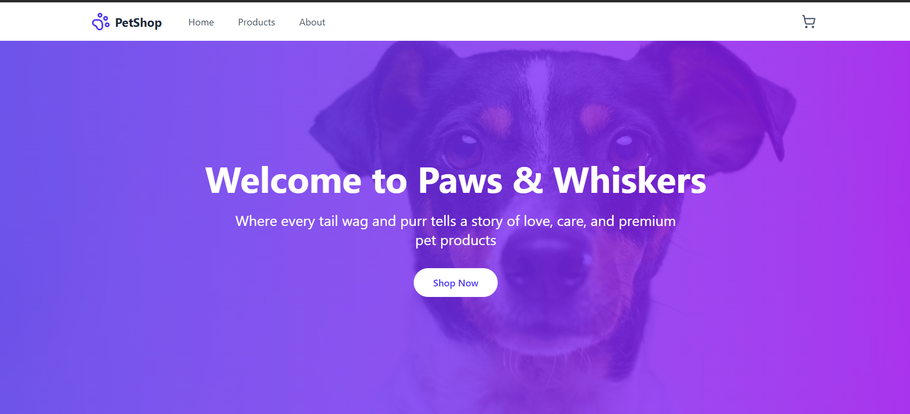
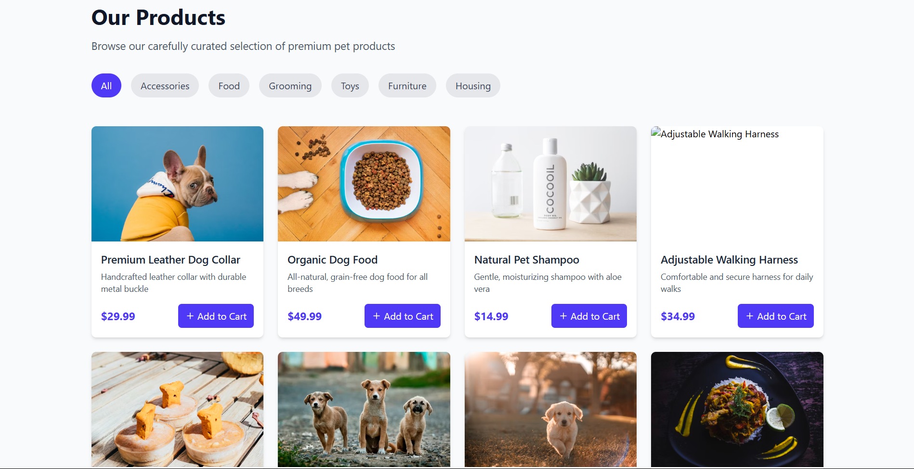

# 🐶 Dog Ecommerce Store - Beginner React Project

This is a **beginner-friendly React project** for an **ecommerce store** selling dog-related products. It helps new developers learn **React components, state management, and API handling** while building a simple **shopping website**.


## 🚀 Features
- 🛍️ **Add to Cart** functionality
- 🐕 **Dog Product Listings** with images & prices
- 🔍 **Filters** (by Accessories, Food, Toys, and many more)
- 🎨 **Fully Responsive** design (mobile & desktop)
- ⚛️ **Built with React (Hooks & State Management)**

## 🎯 Tech Stack
- **React.js** (Functional Components & Hooks)
- **React Router** (for navigation)
- **Styled Components / Tailwind CSS** (for styling)
- **Mock API / JSON Server** (for product data)

## 📦 Installation
Clone this repository and install dependencies:
```sh
$ git clone https://github.com/VedantRaval3011/dog-ecommerce-react.git
$ cd dog-ecommerce-react
$ npm install
$ npm start
```

## 🛠 Usage
- Open `http://localhost:3000/` in your browser.
- Browse dog products, add items to the cart, and proceed to checkout.

## 🎥 Demo
[Live Demo](https://dog-ecommerce.vercel.app/) 

## 📸 Screenshots
### 🛒 Homepage


### 🏷️ Product Page


## 🌟 Why This Project?
This project is perfect for:
- 🎓 **Beginners learning React.js**
- 👨‍💻 **Developers building ecommerce apps**
- 🛒 **Pet shop owners exploring online stores**

## 📜 License
This project is open-source under the **MIT License**.

## 🤝 Contributing
Pull requests are welcome! Feel free to **open an issue** if you find bugs or want to suggest improvements.

---
